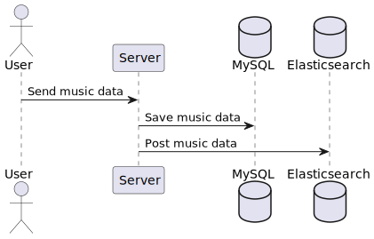
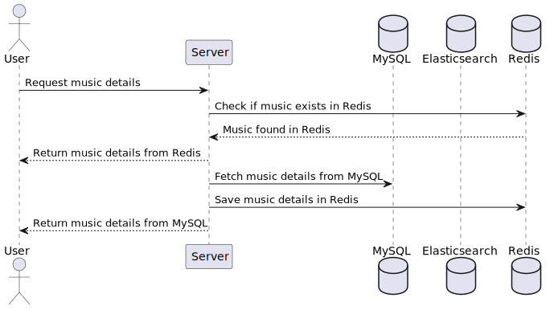

# Implementação do Sequelize, ElasticSearch, BullMq e Cache Redis

## Sobre o projeto
Este projeto tem como objetivo implementar uma integração entre o Sequelize, ElasticSearch, BullMq e Cache Redis. O Sequelize é um ORM (Object-Relational Mapping) para Node.js, que facilita a interação com bancos de dados relacionais. O ElasticSearch é um mecanismo de busca e análise de dados distribuído, que permite realizar pesquisas avançadas em grandes volumes de dados. O BullMq é uma biblioteca para gerenciamento de filas de tarefas assíncronas, enquanto o Cache Redis é um banco de dados em memória que permite armazenar e recuperar dados de forma rápida e eficiente.

Neste projeto, utilizo o Sequelize para realizar operações de CRUD (Create, Read, Update, Delete) em um banco de dados relacional, o ElasticSearch para indexar e pesquisar dados, o BullMq para gerenciar tarefas assíncronas e o Cache Redis para armazenar dados em memória e melhorar o desempenho das consultas.

Espera-se que este projeto seja útil para desenvolvedores que desejam implementar uma solução completa de persistência e busca de dados em suas aplicações Node.js, aproveitando as vantagens oferecidas pelo Sequelize, ElasticSearch, BullMq e Cache Redis, a fim de melhorar aspectos não funcionais como desempenho, escalabilidade e disponibilidade.

## Tecnologias utilizadas
- Node.js
- Sequelize
- ElasticSearch
- BullMq
- kibana
- Redis
- Docker
- Docker Compose
- Express


## Como executar o projeto
Pré-requisitos: Node.js, Docker e Docker Compose

1 - Clonar o repositório
```bash
git clone
```
2 - Entrar na pasta do projeto
```bash
cd sequelize-elastic-bullmq-redis
```

3 - Instalar as dependências
```bash
npm install
```
4 - Suba os containers do ElasticSearch, Kibana e Redis
```bash
docker-compose up -d
```

5 - Configure as variáveis de ambiente
```bash
cp .env.example .env
```
5 - Edite o arquivo .env e configure as variáveis de ambiente
```REDIS_QUEUE_HOST=
REDIS_QUEUE_PORT=
REDIS_QUEUE_PASS=
ELASTICSEARCH_HOST=
ELASTICSEARCH_PORT=
```

6 - Execute as migrations do Sequelize
```bash
npx sequelize-cli db:migrate
```

7 - Execute o projeto (duas etapas)
#### Projeto principal
```bash
npm run start
```
#### Processamento de filas
 - Abra um novo terminal e execute o comando abaixo
```bash
npm run workers
```


# Arquitetura do projeto
Este projeto foi desenvolvido utilizando arquitetura baseada na clean architecture, que é uma arquitetura de software que visa separar as regras de negócio das regras de infraestrutura, de forma que as regras de negócio não dependam de nenhuma biblioteca ou framework externo. Isso permite que as regras de negócio possam ser reutilizadas em diferentes aplicações, sem que seja necessário alterar o código fonte.

a imagem abaixo ilustra a arquitetura do projeto:


# Diagramas de sequência
Os diagramas de sequência abaixo ilustram o fluxo de execução das principais funcionalidades do projeto.

### Adição de musicas


### Listagem de todas as musicas



# Sugestão
para testar a aplicação, utilize o insomnia ou postman para realizar as requisições http.
além disso, sugiro que você crie um script para automatizar a criação de musicas, pois a aplicação não possui uma funcionalidade para isso.
como o script abaixo:
```javascript
    const {faker} = require('@faker-js/faker');

function addMusic(name, lyrics, youtubeLink) {

    fetch('http://suaURL/api/v1/musics', {
        method: 'POST',
        headers: {
            'Content-Type': 'application/json'
        },
        body: JSON.stringify({
            name,
            lyrics,
            youtubeLink
        })
    }).then(res => console.log(res.status))

}

for (let i = 0; i < 5000; i++) {
    addMusic(faker.music.songName(), faker.lorem.sentence(), faker.internet.url());
}
```

# Rotas
### POST /api/v1/musics
Cria uma nova musica
corpo da requisição:
```json
{
    "name": "nome da musica",
    "lyrics": "letra da musica",
    "youtubeLink": "link do youtube"
}
```

### GET /api/v1/musics
Retorna todas as musicas cadastradas

### GET /api/v1/musics/:id - TODO
Retorna uma musica específica (em desenvolvimento)

# Autor
@dinhostork 

# Licença
MIT
